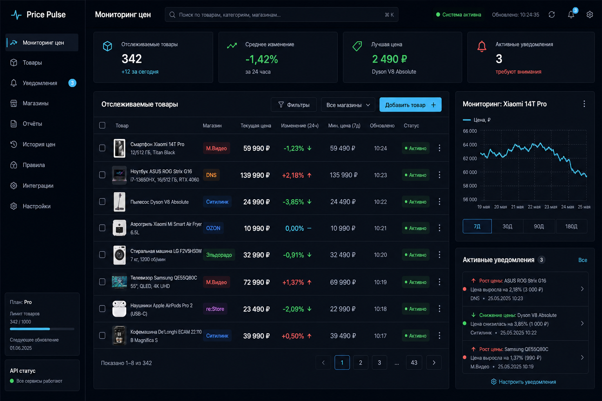

# Price Pulse

## Links

- GitHub: https://github.com/Andrey15211/price-tracker-dashboard
- Live Demo: https://price-tracker-dashboard-one.vercel.app

Price Pulse is a dark fintech-style price tracking dashboard. It demonstrates server logic, API Route Handlers, historical price data, alerts, charts, validated forms, localization, and adapter-based data providers without scraping real marketplaces.



## Stack

- Next.js App Router and TypeScript
- Tailwind CSS
- next-intl
- TanStack Query
- Recharts
- React Hook Form and Zod
- Supabase-ready service boundaries

## Features

- Dashboard with KPI cards, tracked products, price ranges, statuses, and alerts
- Eight realistic demo products with 24 historical points each
- Product detail pages with period filters, chart, and price history table
- Add-product modal with localized Zod validation
- `POST /api/check-price` mock price checks that append history
- Loading, error, empty, and responsive states
- Adapter interface for future authorized provider integrations
- Russian and English interfaces

## RU/EN Localization

Russian is the default language:

- `http://localhost:3000/ru`
- `http://localhost:3000/en`

The root URL redirects to `/ru`. The RU/EN switcher preserves the current application route. User-facing interface text lives in:

- `messages/ru.json`
- `messages/en.json`

`next-intl` provides localized routes, messages, metadata, dates, currency, percentages, validation errors, chart labels, statuses, forms, loading states, and empty states.

## Mock Parser Architecture

`SourceAdapter` defines the provider contract. `MockAdapter` simulates a new price without contacting an external marketplace. `priceService` selects an adapter, requests a price, calculates status, and appends a history point to the development mock store.

Key files:

- `src/adapters/sourceAdapter.interface.ts`
- `src/adapters/mockAdapter.ts`
- `src/services/priceService.ts`
- `src/data/mockStore.ts`
- `src/app/api/check-price/route.ts`

The in-memory store resets when the server process or serverless instance is replaced. A production implementation should replace it with a Supabase repository while keeping the UI and adapter contracts.

## Safety

The project does not bypass anti-bot systems and does not scrape protected marketplaces. Real integrations should use official APIs, authorized affiliate feeds, merchant exports, or other legitimate sources that comply with provider terms.

## Local Setup

Requirements: Node.js 20.9 or newer.

```bash
npm install
npm run dev
```

Open `http://localhost:3000`. It redirects to the Russian interface.

## Environment Variables

No environment variables are required for the mock demo. `.env.example` documents optional variables for a future Supabase implementation:

```env
NEXT_PUBLIC_SUPABASE_URL=
NEXT_PUBLIC_SUPABASE_ANON_KEY=
SUPABASE_SERVICE_ROLE_KEY=
```

Never commit real keys or secrets.

## Quality Checks

```bash
npm run lint
npm run build
```

## API Routes

- `GET /api/products` returns all tracked products.
- `POST /api/products` validates and creates a mock product.
- `GET /api/products/:id` returns one product with its history.
- `POST /api/check-price` accepts `{ "productId": "..." }`, runs the mock adapter, and updates mock history.

## Deploy to Vercel

1. Push the repository to GitHub.
2. Import it into Vercel.
3. Keep the default Next.js framework and `npm run build` settings.
4. Deploy without environment variables for the mock version.
5. Add Supabase environment variables in Vercel only after implementing persistent storage.

Mock mutations are ephemeral on serverless infrastructure and may differ between instances. Persistent products, alerts, and history require Supabase or another database.

## Portfolio Scope

This project demonstrates:

- Typed API design and validation
- App Router server/client boundaries
- Adapter and service architecture
- Time-series data modeling and derived KPIs
- Client cache invalidation with TanStack Query
- Responsive data-heavy dashboard design
- RU/EN localization with next-intl
- Production deployment planning for Vercel and Supabase
