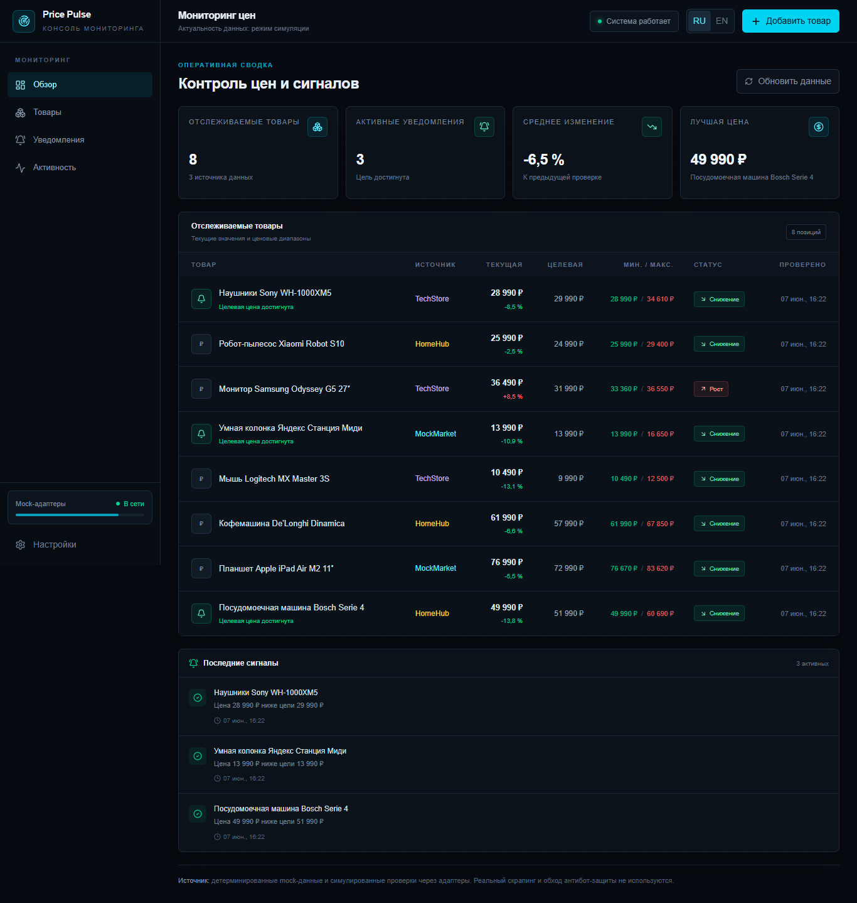
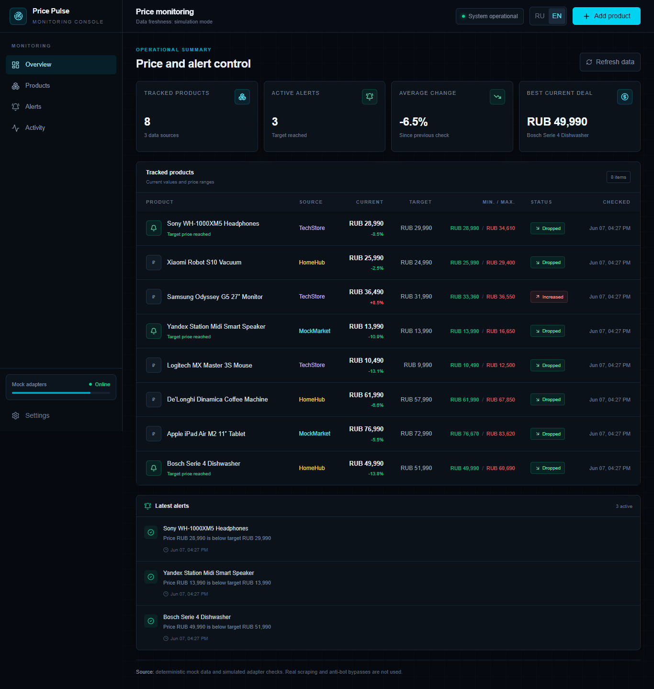

# Price Pulse


Price Pulse is a fintech-style price monitoring dashboard built around deterministic demo data. It demonstrates API Route Handlers, time-series history, alerts, charts, validated product creation, and adapter-based provider boundaries without scraping real marketplaces.

## Live Demo

https://price-tracker-dashboard-one.vercel.app

## Source Code

https://github.com/Andrey15211/price-tracker-dashboard

## Features

- KPI dashboard with tracked products, ranges, statuses, and alerts
- Eight demo products with historical price points
- Product details with period filters, chart, and history table
- Localized add-product form with Zod validation
- Mock price checks through `POST /api/check-price`
- TanStack Query cache and mutation handling
- Adapter interface for future authorized data providers

## Tech Stack

- Next.js 16 App Router
- React 19 and TypeScript
- Tailwind CSS 4
- TanStack Query
- Recharts
- React Hook Form and Zod
- next-intl

## Localization

- RU/EN support: routes, forms, charts, dates, currency, validation, and states
- Default language: Russian (`/ru`)
- Language switcher: available in the dashboard header
- English route: `/en`

## Screenshots

### Desktop



### Mobile

Planned path: `docs/screenshots/mobile.png`

### RU/EN example



Mobile screenshot will be added after final device-width capture.

## Local Development

```bash
npm install
npm run dev
npm run build
```

No environment variables are required for mock mode.

## Deployment

Deployed on Vercel with the Next.js preset. Mock mutations are in-memory and ephemeral across serverless instances; persistent history requires a database integration.

## What this project demonstrates

- Dashboard and data visualization
- API and service-layer design
- Time-series modeling and derived KPIs
- Adapter-based external-provider architecture
- Localized data-heavy frontend UI

## Recommended GitHub Topics

`price-tracker` `dashboard` `data-visualization` `nextjs` `typescript` `recharts` `tanstack-query` `next-intl` `api-routes` `vercel`
